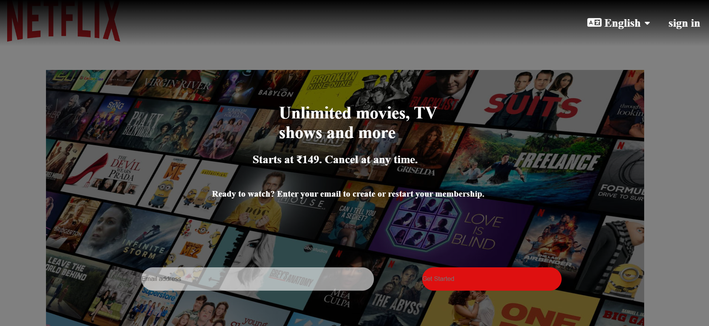

# 🎬 Netflix Homepage Clone

This project is a front-end clone of the Netflix landing page built using **HTML** and **CSS**. It replicates the visual appearance and layout of Netflix’s homepage, including the hero section, logo, background image, and sign-in/get-started buttons.

## 🌟 Features
- 🎨 Netflix-inspired design and layout  
- 💻 Built with pure HTML5 and CSS3  
- 📱 Responsive across devices  
- ⚡ Clean, simple, and fast-loading interface  

## 🛠️ Technologies Used
- HTML5  
- CSS3  

## 📸 Preview
(Screenshot.png)  

## 🚀 How to Run
1. Clone this repository:  
   ```bash
   git clone https://github.com/shilpagorawar/NETFLIX.git
